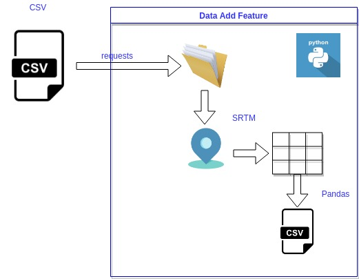

# Estaciones Hidrometeorológicas agregar Altitud
Anexaremos la altitud como una feature al dataset obtenido en el proyecto [ute-estaciones-geoloc](https://ml-as-a-service.github.io/ute-estaciones-geoloc/). Dicha información esta disponible a través del  Shuttle Radar Topography Mission (SRTM) que provee la elevación de acuerdo a la latitud y longitud determinada.

Mas información en [https://www.usgs.gov/centers/eros/science/usgs-eros-archive-digital-elevation-shuttle-radar-topography-mission-srtm-1-arc](https://www.usgs.gov/centers/eros/science/usgs-eros-archive-digital-elevation-shuttle-radar-topography-mission-srtm-1-arc?qt-science_center_objects=0#qt-science_center_objects)


Gráficamente:




Tutorial en Youtube https://youtu.be/ahAXtQ2xT8s :

[](https://www.youtube.com/watch?v=ahAXtQ2xT8s)


## Instalación de dependencias
Instalamos las librerías dependientes desde requirements.txt

```bash
pip3 install -r requirements.txt
```

## Ejecutar
Al ejecutar el comando

```bash
python run.py
```
Se procederá a:
- crear la estructura de directorios
- descargar el archivo fuente en la carpeta tmp/download
- exportar la información con las altitudes de las estaciones que se encuentran en el archivo a csv, el mismo se guardara en la carpeta data/


# Fix de Performance
En nuestro caso realizaremos un fix de performance para la consulta de grandes volumenes de geolocalizaciones. Para ellos bajaremos los archivos desde la pagina [http://viewfinderpanoramas.org/Coverage%20map%20viewfinderpanoramas_org3.htm](http://viewfinderpanoramas.org/Coverage%20map%20viewfinderpanoramas_org3.htm)

Seleccionaremos los cuadrantes para uruguay en nuestro caso 'SG21','SG22',  'SH21','SH22',  'SI21','SI22'y  'SJ21'. Estos nos permitirá realizar las consultas sin ser bloqueados por el servidor de STRM.
